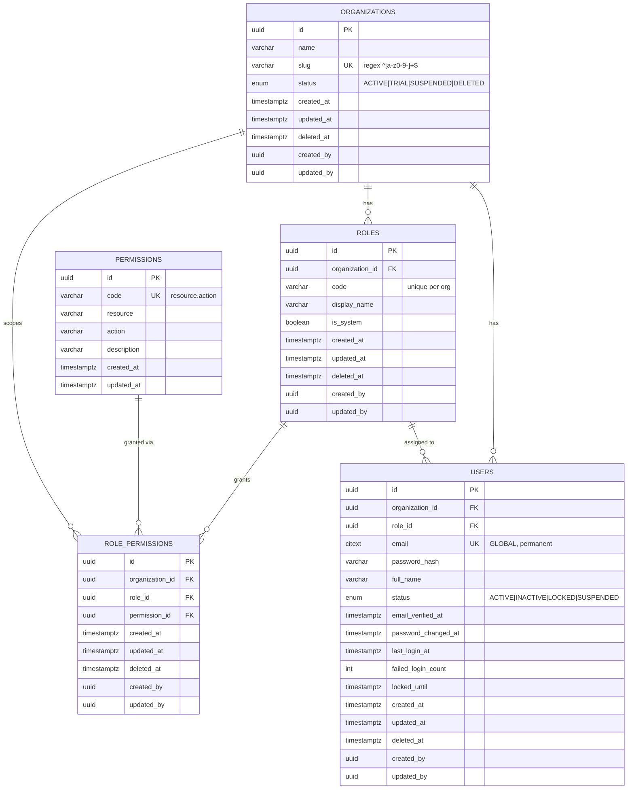

# Database Design — Auth Module (Sprint 1)

> Product: **NCMedia Management Platform**
> Module: **Authentication & RBAC Foundation**
> Version: 1.0 · Status: **✅ ACCEPTED** · Ngày: 2026-07-14
> Nguồn: `docs/auth.md` (v2.0), `docs/auth-decisions.md`, `architecture/ADR.md` (ADR-003, 004, 005, 010, 011, 015).
> Schema tương ứng: `prisma/schema.prisma`.
>
> Tài liệu này mô tả thiết kế database cho module Auth. **Không sinh migration** — phần migration thực hiện ở bước sau.

---

## 1. Quy ước chung

Áp dụng cho toàn bộ bảng nghiệp vụ (ADR-005, ADR-015, CLAUDE.md Mục 11):

- **Primary Key:** `UUID` (`@default(uuid())`), không auto-increment.
- **Soft delete:** cột `deleted_at` (NULL = còn hiệu lực).
- **Audit:** `created_at`, `updated_at`, `deleted_at`, `created_by`, `updated_by`.
- **Multi-tenant:** bảng nghiệp vụ có `organization_id`. Enforce ở tầng Backend (repository nhận `organizationId`) — không dùng RLS (ADR-004).
- **Kiểu thời gian:** `timestamptz` (UTC).
- **Ngoại lệ Global:** `permissions` là catalog dùng chung — **không** `organization_id`, **không** soft delete (Decision-008, ADR-003/011).

---

## 2. Enums

| Enum | Giá trị | Ghi chú |
|---|---|---|
| `UserStatus` | `ACTIVE`, `INACTIVE`, `LOCKED`, `SUSPENDED` | Mặc định `ACTIVE`. Chỉ `ACTIVE` được login (bổ sung PO #4). |
| `OrganizationStatus` | `ACTIVE`, `TRIAL`, `SUSPENDED`, `DELETED` | Mặc định `ACTIVE` (bổ sung PO #5). |

**Phân biệt khóa tài khoản:**
- `locked_until` (timestamptz): khóa **tạm thời** do đăng nhập sai 5 lần → khóa 15' (Decision-004). Transient, không đổi `status`.
- `status = LOCKED`: khóa **bền vững** do quyết định bảo mật/PO.

---

## 3. Danh sách bảng

| Bảng | Loại | organization_id | Soft delete |
|---|---|---|---|
| `organizations` | Tenant root | — | ✅ |
| `users` | Tenant-scoped | ✅ | ✅ |
| `roles` | Tenant-scoped | ✅ | ✅ |
| `permissions` | **Global catalog** | ❌ | ❌ |
| `role_permissions` | Tenant-scoped | ✅ | ✅ |

> **Không có bảng `user_roles`** — do một User có đúng 1 Role (Decision-007), quan hệ là FK `users.role_id`.

---

## 4. Chi tiết bảng

### 4.1. `organizations`

| Cột | Kiểu | Ràng buộc |
|---|---|---|
| id | uuid | PK |
| name | varchar(255) | NOT NULL |
| slug | varchar(120) | **UNIQUE**, NOT NULL, regex `^[a-z0-9-]+$` |
| status | organization_status | NOT NULL, default `ACTIVE` |
| created_at / updated_at | timestamptz | NOT NULL |
| deleted_at | timestamptz | NULL |
| created_by / updated_by | uuid | NULL |

### 4.2. `users`

| Cột | Kiểu | Ràng buộc |
|---|---|---|
| id | uuid | PK |
| organization_id | uuid | FK → organizations.id, NOT NULL |
| role_id | uuid | FK → roles.id, NOT NULL (Decision-007) |
| email | citext | **UNIQUE GLOBAL vĩnh viễn**, NOT NULL |
| password_hash | varchar(255) | NOT NULL (bcrypt cost 12) |
| full_name | varchar(255) | NOT NULL |
| status | user_status | NOT NULL, default `ACTIVE` |
| email_verified_at | timestamptz | NULL (dùng cho Verify Email — S2) |
| password_changed_at | timestamptz | NULL |
| last_login_at | timestamptz | NULL |
| failed_login_count | int | NOT NULL, default 0 |
| locked_until | timestamptz | NULL |
| audit cols | | |

> **email UNIQUE GLOBAL (Decision-001 + bổ sung PO):** UNIQUE thường trên toàn bảng, **KHÔNG** partial index (`WHERE deleted_at IS NULL`). Bản ghi xóa mềm **vẫn giữ chỗ** email → **không cho phép tái sử dụng** email đã xóa.

### 4.3. `roles`

| Cột | Kiểu | Ràng buộc |
|---|---|---|
| id | uuid | PK |
| organization_id | uuid | FK, NOT NULL |
| code | varchar(50) | NOT NULL (VD `admin`) |
| display_name | varchar(100) | NOT NULL (bổ sung PO #6) |
| is_system | boolean | NOT NULL, default false |
| audit cols | | |

Ràng buộc: **UNIQUE `(organization_id, code)`**. Role `is_system=true` (admin/employee/fulfillment) không được xóa.

### 4.4. `permissions` (Global catalog)

| Cột | Kiểu | Ràng buộc |
|---|---|---|
| id | uuid | PK |
| code | varchar(100) | **UNIQUE**, NOT NULL (VD `role.read`) |
| resource | varchar(50) | NOT NULL |
| action | varchar(50) | NOT NULL |
| description | varchar(255) | NULL |
| created_at / updated_at | timestamptz | NOT NULL |

> Không có `organization_id`, không soft delete, không `created_by/updated_by` — đây là catalog hệ thống (Decision-008).

### 4.5. `role_permissions`

| Cột | Kiểu | Ràng buộc |
|---|---|---|
| id | uuid | PK |
| organization_id | uuid | FK, NOT NULL |
| role_id | uuid | FK → roles.id, NOT NULL |
| permission_id | uuid | FK → permissions.id, NOT NULL |
| audit cols | | |

Ràng buộc: **UNIQUE `(role_id, permission_id)`**. Permission **chỉ** gán qua bảng này cho Role — **không bao giờ** gán trực tiếp cho User (BR-15, bổ sung PO #2).

---

## 5. Quan hệ (Relationships)

| Từ | Đến | Loại | Ghi chú |
|---|---|---|---|
| Organization | User | 1 — N | Một org có nhiều user |
| Organization | Role | 1 — N | Role động theo org |
| Organization | RolePermission | 1 — N | Gán quyền tenant-scoped |
| Role | User | 1 — N | Một Role có nhiều User; mỗi User đúng 1 Role |
| Role | RolePermission | 1 — N | |
| Permission | RolePermission | 1 — N | Permission global, gán vào nhiều role |

Referential actions: FK bắt buộc dùng `onDelete: Restrict` (không hard-delete vì đã soft delete), riêng `role_permissions.role_id` dùng `Cascade`.

---

## 6. ERD (Mermaid)

---

## 7. Chỉ mục (Indexes)

| Bảng | Index | Kiểu |
|---|---|---|
| organizations | `slug` | UNIQUE |
| users | `email` | UNIQUE (global) |
| users | `organization_id` | BTREE |
| users | `role_id` | BTREE |
| roles | `(organization_id, code)` | UNIQUE |
| roles | `organization_id` | BTREE |
| permissions | `code` | UNIQUE |
| permissions | `resource` | BTREE |
| role_permissions | `(role_id, permission_id)` | UNIQUE |
| role_permissions | `role_id`, `permission_id`, `organization_id` | BTREE |

---

## 8. Ràng buộc cần thêm ở bước Migration

Prisma schema không biểu diễn được — sẽ bổ sung khi viết migration:

1. **CHECK regex slug:** `CHECK (slug ~ '^[a-z0-9-]+$')` trên `organizations`.
2. **Extension `citext`:** cần `CREATE EXTENSION IF NOT EXISTS citext;` (đã khai báo `extensions = [citext]` trong datasource; nếu không dùng preview thì bật thủ công).
3. **(Tùy chọn) CHECK** đảm bảo `failed_login_count >= 0`.

---

## 9. Redis — Dữ liệu ephemeral (không có bảng)

| Key | Nội dung | TTL |
|---|---|---|
| `refresh:{userId}:{jti}` | `{ tokenHash, organizationId, ua, ip, exp }` | 7 ngày |
| `pwd_reset:{userId}:{jti}` | `{ tokenHash, exp }` | 30 phút (Decision-012) |
| `email_verify:{userId}:{jti}` | `{ tokenHash, exp }` | 24 giờ (Decision-011) |
| `login_fail:{email}:{ip}` | counter | 15 phút (Decision-004) |

---

## 10. Kế hoạch Seed

1. **Permission catalog (global)** — seed một lần toàn hệ thống. Sprint 1 tối thiểu:
   `organization.read`, `role.read`, `role.create`, `role.update`, `role.delete`,
   `permission.read`, `user.read`, `user.create`, `user.update`, `user.delete`.
2. **Khi register 1 Organization** (trong transaction):
   1. Tạo `organizations` (status `ACTIVE`, slug hợp lệ).
   2. Tạo 3 `roles`: `admin`, `employee`, `fulfillment` (`is_system=true`, `display_name` tương ứng).
   3. `role_permissions`: gán toàn bộ permission catalog cho role `admin`.
   4. Tạo `users` (admin đầu tiên, `status=ACTIVE`, `role_id = admin.id`).

> **Thứ tự bắt buộc:** tạo `roles` trước `users` (vì `users.role_id NOT NULL`).

---

## 11. Lưu ý & rủi ro

1. **email global unique + soft delete:** email đã xóa mềm **không** dùng lại được (Decision-001). Nếu cần "giải phóng" email, phải hard-delete hoặc đổi email bản ghi cũ — quyết định vận hành, ngoài Sprint 1.
2. **role_permissions + soft delete:** khi thu hồi quyền, nên **reactivate** bản ghi cũ (nếu đã soft-deleted) thay vì insert mới để tránh vi phạm UNIQUE `(role_id, permission_id)`. Xử lý ở tầng Backend.
3. **Tenant isolation:** DB chỉ giữ FK; cô lập tenant enforce ở code (ADR-004). Cần test 2 org không thấy dữ liệu của nhau ở bước Backend.
4. **`permissions` không soft delete:** thay đổi catalog là thao tác migration/seed có kiểm soát, không xóa mềm runtime.

---

> **Kết luận:** Thiết kế database module Auth đã hoàn chỉnh và nhất quán với `schema.prisma`. Sẵn sàng cho bước Migration khi có yêu cầu. Chưa sinh migration/NestJS/Frontend theo phạm vi hiện tại.
